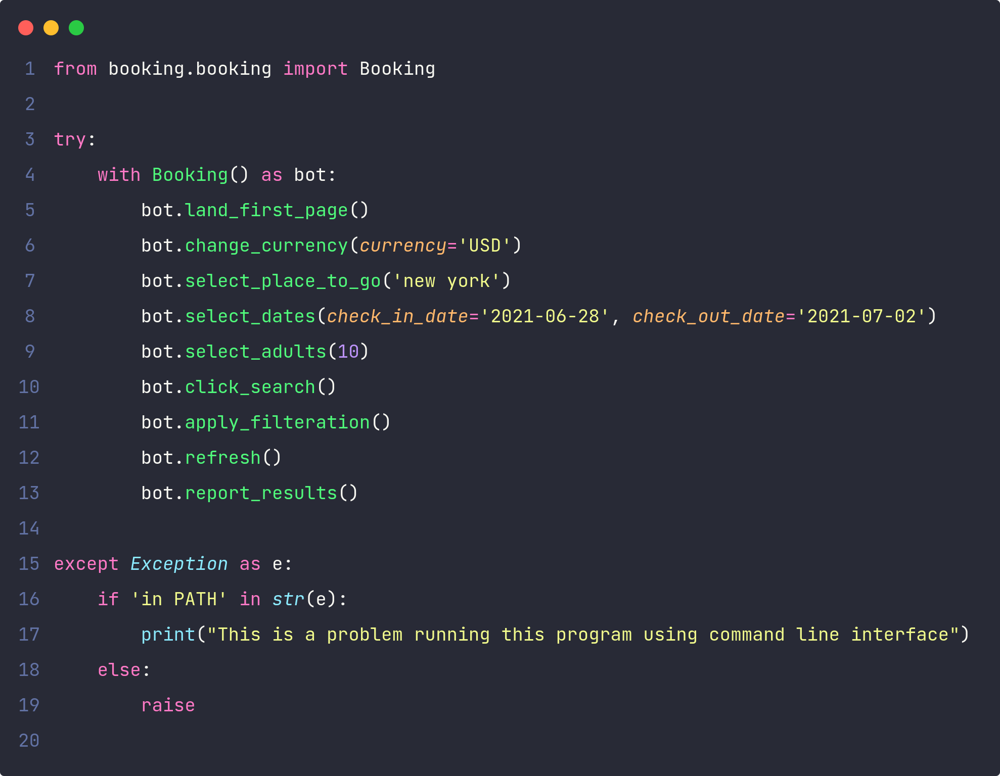
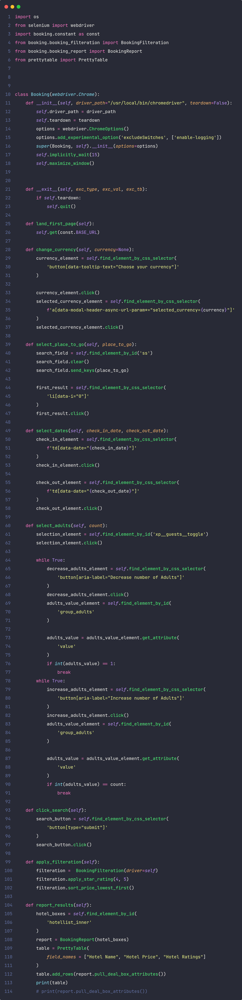

# Selenium Install

pip3 install selenium 

         or
pip install selenium

# Install chrome driver
First, check your chrome version and download from the below link

https://chromedriver.chromium.org/downloads

# Need to do some changes
#### 1.) Give the path of your chrome driver
      Open booking/booking.py and change the path on line 11.
#### 2.) Change currency, visiting place, check-in and check-out date(YYYY-MM-DD).
      Open main.py and change the line 6, 7, 8

